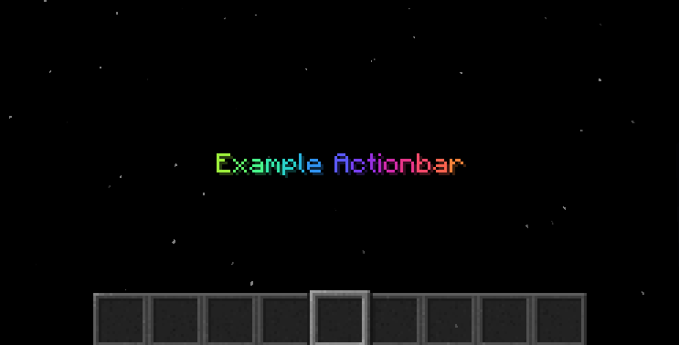
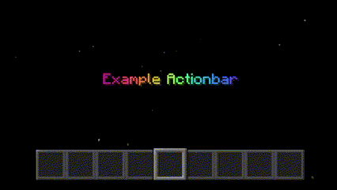

# JMC Modules
 Useful JMC Modules that can be imported to your datapacks.


## Modules

##### Colors

The provided JMC module defines a Python function named `rainbowColor` that takes a `text` string and an optional `time` parameter (defaulting to 0) as input and generates an array of characters, each associated with a rainbow color determined by rainbowGradiant. The output is a JSON-like string representation of this array. It utilizes the math module to perform trigonometric calculations and produces a color with changing shades of red, green, and blue.

```js
import "colors.jmc";

JMC.python(`
emit(f'title @a actionbar {rainbowColor("Example Actionbar")}')
`, "colors");
```


This can also be animated using the `time` parameter and built in `Hardcode.repeat()` function.

```js
import "colors.jmc";

function rainbow() {
    Hardcode.repeat(
        "time",
        () => {
            schedule time {
                JMC.python(`
                    emit(f'title @a actionbar {rainbowColor("Example Actionbar", time)}')
                `, "colors");
            }
        },
        0,
        60,
        1
    );
    schedule function rainbow() 60t;
}
```
